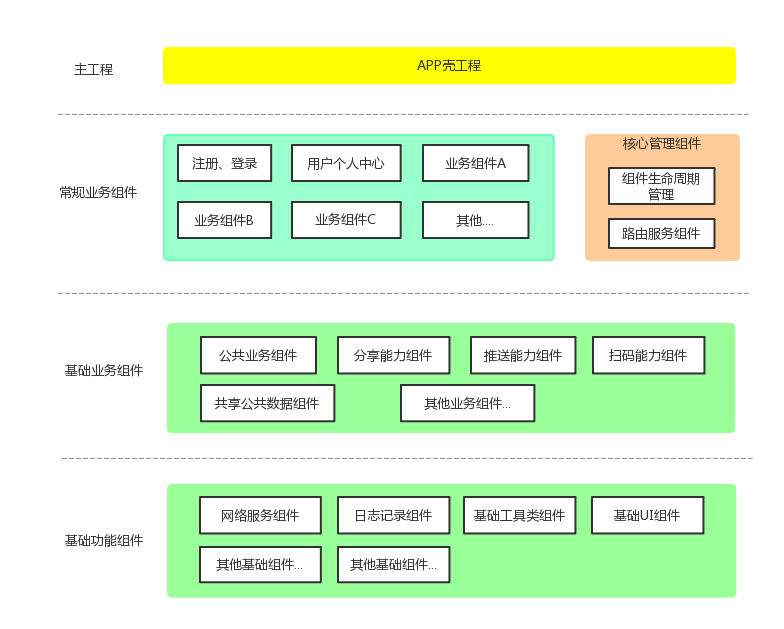
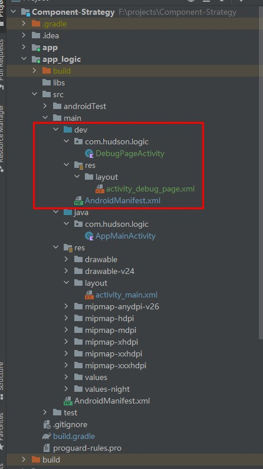
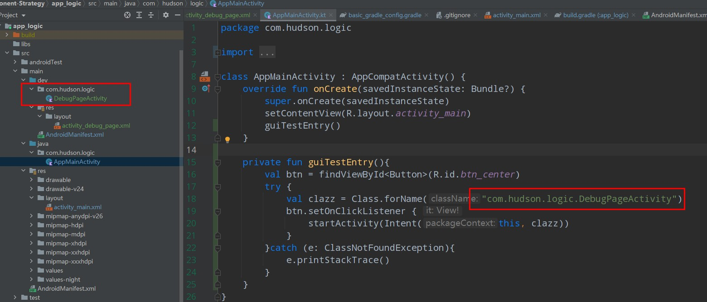
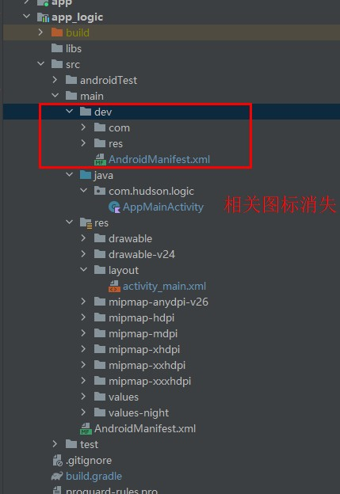

# Component-Strategy
组件化方案优点：

- 充分体现高内聚，低耦合特性，益于后续维护升级
- 各个组件单独测试，编译速度提高
- 功能业务重用
- 团队并行开发，效率提升

## 1.组件化的目标
- 1.各个组件无耦合关系，相互独立，可拔插
- 2.组件可以单独测试验证或独立运行

组件构成上，由最上层的app壳 + 本身app主功能业务组件 + 常规业务组件（和基础业务组件） + 基础功能组件构成。

本身app主功能业务组件跟app本身功能关联度最大，与常规业务组件不同，能够被复用于其他应用的可能性更低。

[壳工程](app)作为“傀儡”，仅负责处理启动屏，和统筹依赖其他业务组件以及app主功能业务组件。

### 1.1 [各组件依赖版本管理问题](basic_gradle_config.gradle)
为了统一管理各个组件的依赖库版本，以及统一使用一个Gradle版本构建，因此新增一个统一的gradle配置文件（将该文件作为远程依赖，远程可视化视图配置参数将更便捷地控制版本）。 
### 1.2 业务组件的可测试性
为了确保业务组件本身可以单独进行除了基础的单元测试之外，还能进行GUI测试，因此应该确保业务组件本身的可应用化的特性。

因此需要手动控制部分代码文件，以确保在组件自我测试验证时保持应用的主体性，而在作为组件引入其他上传业务组件中时作为组件模块提供功能。

借助于Gradle的sourceSets和android的application和library特性来实现这一点。

#### 1）控制组件和应用的特性来回切换
继续在[公共Gradle配置文件]((basic_gradle_config.gradle))中新增是否集成的标记flag，通过该标记控制是组件还是应用。  

**注：为了考虑到组件自身的独立控制性，可以考虑将标记下沉给组件开发方控制，此处为了多个模块统一控制，使用公共Gradle配置文件。**

	flags = [
        // 控制业务组件是否集成，如果是false，业务组件将作为应用程序方式运行，即构建产物是apk
        isRelease: false
    ]

组件中的配置：
	// 1) 切换application和library
	plugins {
	    // 不能这样使用
	//    if(flags.isRelease){
	//        id 'com.android.application'
	//    }else{
	//        id 'com.android.library'
	//    }
	    id 'org.jetbrains.kotlin.android'
	}
	
	// 必须按照旧版Gradle的方式
	if(flags.isRelease){
	    apply plugin: 'com.android.application'
	}else{
	    apply plugin: 'com.android.library'
	}

	// 2)切换applicationId
	android {
	    defaultConfig {
	        if(!flags.isRelease){
	            applicationId "com.hudson.order"
	        }
	    }
	}

**注意：**

- 1.示例工程的Gradle版本是7.4.2，Gradle新增了plugins{}方式引入Gradle插件，但是内部不支持其他声明，包括If-else。 因此需要使用旧版的引入方式，即apply plugin
- 2.plugins的声明必须优先于其他声明。 例如把apply plugin段放到plugins前面将会报错

#### 2）控制Manifest中启动activity的状态
当业务组件被当成组件接入壳工程时，由于本身可以被配置成应用，所以manifest中的启动activity是有配置的，这样导致的结果是我们安装app壳工程时，**将会在桌面上产生多个启动图标**。

为了解决这个问题，manifest文件需要根据不同环境因素而有不同的表现形式。

为此我们可以借助Gradle的sourceSet功能在非集成状态下，指定另一份manifest源码文件。

	android{
		sourceSets {
	        main{
	            if(flags.isRelease){
	                manifest.srcFile 'src/main/AndroidManifest.xml'
	                // 打包时要排除掉dev目录
	                java {
	                    exclude 'src/main/dev/'
	                }
	            }else{
	                manifest.srcFile 'src/main/dev/AndroidManifest.xml'
	            }
	        }
	    }
	}

#### 3）[控制部分仅非集成情况下可见的页面](app_logic/build.gradle)
**由于组件化特性，本身部分组件仅有一些自身的主体逻辑的情况下，是无法走完自我测试验证的GUI整体流程的**。 

例如分享组件，本身实现的功能就是分享，那么GUI测试的话，必然需要一个页面承载主动调起分享组件的能力，这个时候就需要一个页面，且携带一个按钮，按钮点击后，带上分享相关的参数，调用分享组件实际主体业务，以完成功能测试，而**不是得依赖其他的应用功能来完成自测**.

这种情况下，我们可以手动在非集成情况下增加源码、资源的搜索路径，然后这些页面仅在非集成状态下可以被正常调用。

	   sourceSets {
	        main{
	            if(flags.isRelease){
	                manifest.srcFile 'src/main/AndroidManifest.xml'
	                // 打包时要排除掉dev目录
	                java {
	                    exclude 'src/main/dev/'
	                }
	            }else{
	                manifest.srcFile 'src/main/dev/AndroidManifest.xml'
	
	                // 增加源码搜索路径 src/main/dev目录
	                java{
	                    srcDir 'src/main/dev'
	                }
	
	                // 参考 https://developer.android.com/studio/build/build-variants#sourcesets
	                res.srcDirs = ['src/main/res/', 'src/main/dev/res/']
	            }
	        }
	    }

这样，在非集成模式下，代码源将会增加dev目录下的内容，包括资源文件（这里是layout布局文件）

我们在主体代码中增加GUI测试的预留入口(仅示例)

这样单独运行业务组件（此时为应用程序状态），我们可以进入到dev中定义的页面DebugPageActivity中去。

而当我们切换成组件状态（即集成模式）下，DebugPageActivity是没法被找到的，即预留入口本身无意义。

#### 总结
这样能保证，

**在集成模式下，组件正常以子功能/子模块的形式被引入到壳工程中**；

**非集成模式下，组件以应用的身份且可以运用仅开发时期的页面完成相关的GUI测试验证。**

## 参考文档
1. [工程-study_module](https://github.com/zouchanglin/study_module)
2. [视频-Android组件化实战](https://www.bilibili.com/video/BV1Ar4y1A7kh?spm_id_from=333.788.top_right_bar_window_custom_collection.content.click)
3. [Android官方-配置 build 变体 ](https://developer.android.com/studio/build/build-variants#sourcesets)
4. [Gradle官方-配置sourceSets](https://docs.gradle.org/current/userguide/building_java_projects.html#sec:custom_java_source_set_paths)