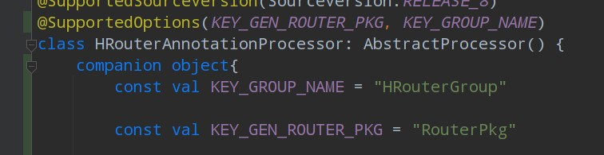
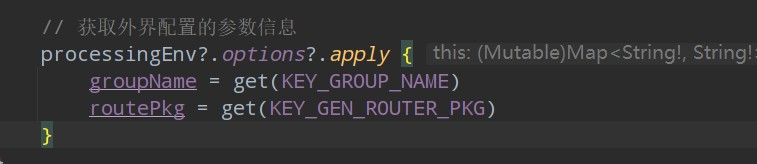
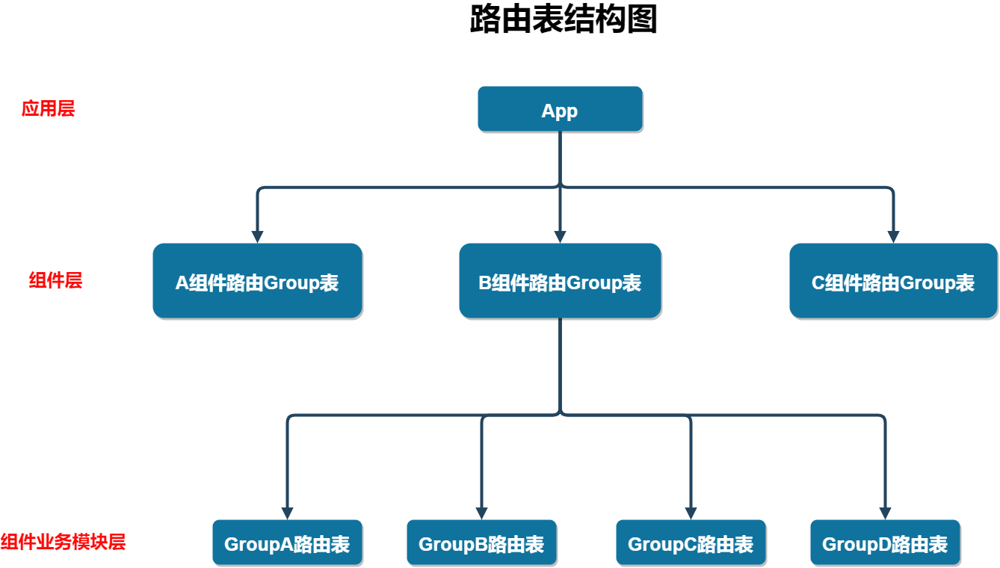
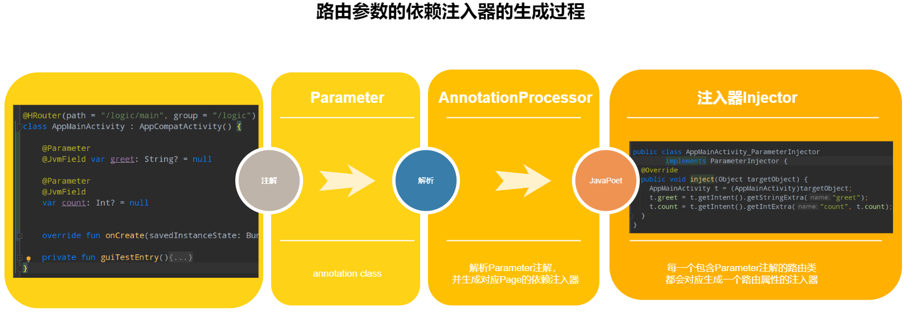

# Component-Strategy  组件化方案
组件化方案优点：

- 充分体现高内聚，低耦合特性，益于后续维护升级
- 各个组件单独测试，编译速度提高
- 功能业务重用
- 团队并行开发，效率提升

## 1.组件化的目标
- 1.各个组件无耦合关系，相互独立，可拔插
- 2.组件可以单独测试验证或独立运行

组件构成上，由**最上层的app壳 + 本身app主功能业务组件 + 常规业务组件（和基础业务组件） + 基础功能组件**构成。

本身app主功能业务组件跟app本身功能关联度最大，与常规业务组件不同，能够被复用于其他应用的可能性更低。

[壳工程](app)作为“傀儡”，仅负责处理启动屏，和统筹依赖其他业务组件以及app主功能业务组件。

### 1.1 [各组件依赖版本管理问题](basic_gradle_config.gradle)
为了统一管理各个组件的依赖库版本，以及统一使用一个Gradle版本构建，因此新增一个统一的gradle配置文件（将该文件作为远程依赖，远程可视化视图配置参数将更便捷地控制版本）。 
### 1.2 业务组件的可测试性
为了确保业务组件本身可以单独进行除了基础的单元测试之外，还能进行GUI测试，因此应该确保业务组件本身的可应用化的特性。

因此需要手动控制部分代码文件，**以确保在组件自我测试验证时保持应用的主体性，而在作为组件引入其他上传业务组件中时作为组件模块提供功能**。

借助于Gradle的sourceSets和android的application和library特性来实现这一点。

#### 1）控制组件和应用的特性来回切换
在[公共Gradle配置文件](basic_gradle_config.gradle)中新增是否集成的标记flag，通过该标记控制是组件还是应用。  

**注：为了考虑到组件自身的独立控制性，可以考虑将标记下沉给组件开发方控制，此处为了多个模块统一控制，使用公共Gradle配置文件。**

	flags = [
        // 控制业务组件是否集成，如果是false，业务组件将作为应用程序方式运行，即构建产物是apk
        isRelease: false
    ]

组件中的配置：

	// 1) 切换application和library
	plugins {
	    // 不能这样使用
	//    if(flags.isRelease){
	//        id 'com.android.application'
	//    }else{
	//        id 'com.android.library'
	//    }
	    id 'org.jetbrains.kotlin.android'
	}
	
	// 必须按照旧版Gradle的方式
	if(flags.isRelease){
	    apply plugin: 'com.android.application'
	}else{
	    apply plugin: 'com.android.library'
	}

	// 2)切换applicationId
	android {
	    defaultConfig {
	        if(!flags.isRelease){
	            applicationId "com.hudson.order"
	        }
	    }
	}

**注意：**

- 1.示例工程的Gradle版本是7.4.2，Gradle新增了plugins{}方式引入Gradle插件，但是内部不支持其他声明，包括If-else。 因此需要使用旧版的引入方式，即apply plugin
- 2.plugins的声明必须优先于其他声明。 例如把apply plugin段放到plugins前面将会报错

#### 2）控制Manifest中启动activity的状态
当业务组件被当成组件接入壳工程时，由于本身可以被配置成应用，所以manifest中的启动activity是有配置的，这样导致的结果是我们安装app壳工程时，**将会在桌面上产生多个启动图标**。

为了解决这个问题，manifest文件需要根据不同环境因素而有不同的表现形式。

为此我们可以借助Gradle的sourceSet功能在非集成状态下，指定另一份manifest源码文件。

	android{
		sourceSets {
	        main{
	            if(flags.isRelease){
	                manifest.srcFile 'src/main/AndroidManifest.xml'
	                // 打包时要排除掉dev目录
	                java {
	                    exclude 'src/main/dev/'
	                }
	            }else{
	                manifest.srcFile 'src/main/dev/AndroidManifest.xml'
	            }
	        }
	    }
	}

#### 3）[控制部分仅非集成情况下可见的页面](app_logic/build.gradle)
**由于组件化特性，本身部分组件仅有一些自身的主体逻辑的情况下，是无法走完自我测试验证的GUI整体流程的**。 

例如分享组件，本身实现的功能就是分享，那么GUI测试的话，必然需要一个页面承载主动调起分享组件的能力，这个时候就需要一个页面，且携带一个按钮，按钮点击后，带上分享相关的参数，调用分享组件实际主体业务，以完成功能测试，而**不是得依赖其他的应用功能来完成自测**.

这种情况下，我们可以手动在非集成情况下增加源码、资源的搜索路径，然后这些页面仅在非集成状态下可以被正常调用。

	   sourceSets {
	        main{
	            if(flags.isRelease){
	                manifest.srcFile 'src/main/AndroidManifest.xml'
	                // 打包时要排除掉dev目录
	                java {
	                    exclude 'src/main/dev/'
	                }
	            }else{
	                manifest.srcFile 'src/main/dev/AndroidManifest.xml'
	
	                // 增加源码搜索路径 src/main/dev目录
	                java{
	                    srcDir 'src/main/dev'
	                }
	
	                // 参考 https://developer.android.com/studio/build/build-variants#sourcesets
	                res.srcDirs = ['src/main/res/', 'src/main/dev/res/']
	            }
	        }
	    }

这样，在非集成模式下，代码源将会增加dev目录下的内容，包括资源文件（这里是layout布局文件）

我们在主体代码中增加GUI测试的预留入口(仅示例)

这样单独运行业务组件（此时为应用程序状态），我们可以进入到dev中定义的页面DebugPageActivity中去。

而当我们切换成组件状态（即集成模式）下，DebugPageActivity是没法被找到的，即预留入口本身无意义。

#### 总结
这样能保证，

**在集成模式下，组件正常以子功能/子模块的形式被引入到壳工程中**；

**非集成模式下，组件以应用的身份且可以运用仅开发时期的页面完成相关的GUI测试验证。**

## 2.路由实现
经过上面组件拆分后，各个组件之间的页面跳转还是依赖了Activity的startActivity方法，这样**导致跳转组件涉及的双方会有直接的类依赖关系**，未完全解耦。

因此有必要提供一个路由工具，将各个业务组件整合起来，解除各自的依赖关系。

这个首先想到的就是[ARouter框架](https://github.com/alibaba/ARouter)

我们手动来实现类似ARouter的功能。
### 2.1 APT(Annotation Processing Tool)
利用注解动态动态生成代码已经非常常见，像ButterKnife、Dagger、EventBus、ARouter等都是借助了APT注解处理器来完成的。

其中[EventBus](https://github.com/greenrobot/EventBus/blob/master/EventBusAnnotationProcessor/src/org/greenrobot/eventbus/annotationprocessor/EventBusAnnotationProcessor.java)是没有借助任务第三方代码生成工具，像写字符串一样完成的java文件的动态生成。

一般情况会借助[JavaPoet](https://github.com/square/javapoet)来完成java文件的动态生成。

### 2.2 自定义注解和注解处理器
#### 1)新建自定义注解[HRouter](HRouter-Annotation)

	@Target(AnnotationTarget.CLASS) // 作用在类上
	@Retention(AnnotationRetention.SOURCE) // 编译期生效
	annotation class HRouter(
	    val path: String,
	    val group: String = "" // 一般指定为组件名
	)
#### 2）新建自定义注解处理器[HRouter-Annotation-Processor](HRouter-Annotation-Processor)

	@AutoService(Processor::class)
	@SupportedAnnotationTypes("com.hudson.hrouter.annotation.HRouter") // 需要处理的注解类
	@SupportedSourceVersion(SourceVersion.RELEASE_8)
	class HRouterAnnotationProcessor: AbstractProcessor() {
		// ...
	}

注意：

- 1.注解处理器module需要依赖HRouter注解module
- 2.kotlin中要使用auto-service的话要借助kapt，而不是annotation-processor
- 3.注解处理器一旦make project一次之后，后面make project不会触发处理器的逻辑处理，需要先build clean之后重新make project

#### 3）依赖关系梳理
注解HRouter可能在各个业务组件的各个页面都要使用，因此将HRouter注解的依赖通过api方式放入**基础功能组件common**中；

而注解处理器由于kapt或者annotationProcessor只对当前module有效且不向上传递依赖，因此注解处理器需要在各个需要配置路由的业务组件上增加依赖。

#### 4）附录
编译器给注解处理器传递参数。

大部分情况下，一个组件的页面都同属于一个路由组，不同组件处于不同的路由组，因此可以给路由组直接传递模块名或者模块标识。  

我们可以直接给注解处理器在处理模块时传递模块名或模块标识，用于统一归纳路由组。

		// 给内部的注解处理器传递参数
        javaCompileOptions {
            annotationProcessorOptions{
                arguments = [
                    HRouterGroup: name,// 路由分组直接指定为模块名
                    RouterPkg: hroute_info.packageName // 路由代码生成的包名
                ]
            }
        }

### 2.3 路由表的维护
在ARouter中维护了多张路由映射关系表，并在初始化阶段会加载ARouter指定APT的生成包名下遍历查找所有的生成类，参见ARouter的[LogisticsCenter](https://github.com/alibaba/ARouter/blob/develop/arouter-api/src/main/java/com/alibaba/android/arouter/core/LogisticsCenter.java)的init方法。

ARouter中分为group和实际的path，一般情况下group可以不用设置。

一个组件中可能存在多个group，因此ARouter对应于每一个组件都会生成一个Group的集合类（不是Collection类型，而是指承载了一个group集合的类），这个类的类名有组件名参与组成文件名规则，因此ARouter需要在Gradle中配置注解处理器的传递参数

	android {
	    defaultConfig {
	        ...
	        javaCompileOptions {
	            annotationProcessorOptions {
	                arguments = [AROUTER_MODULE_NAME: project.getName()] // 传递组件名
	            }
	        }
	    }
	}

另外还需要生成一张每个group中配置的路由集合表的类，这个类的文件名规则需要group参与。

尽管如此，可能**存在的冲突问题**是，假设A组件声明了路由group为 order； B组件声明的路由group也为 order，那么生成的最终文件由于只有group参与文件名规则，因此必然存在冲突，这个是需要注意的地方。 （可以参考[这篇文章](https://juejin.cn/post/6844903731599769608)）

#### 2.3.1 组件路由组表的维护
为了更好地管理当前组件中不同的路由组group，因此可以将组件中不同group的路由集合归纳到一个集合中，通过group名可以在该集合中找到对应的group中所有路由的集合，整体关系大致如下：

前面提到，为了避免各个组件的组件路由Group文件名冲突，因此加入组件名参与文件名的规则。

但是考虑到运行期间，应用程序无法知晓所配置的路由具体属于哪个组件（所以建议上路由group与组件名存在一定关系），因此需要在初始化阶段加载所有组件各自对应的组件路由Group表，合并路由Group表（注：不同的组件不能定义相同的group，因为会在生成Group-Path最底层表的时候出现重复类文件问题，见上面分析）。

**性能问题的考量:**

一个组件对应了一个组件路由Group表类，需要经过反射来实例化这个类（性能损耗点1）；另外运行期间无法知晓路由组group与路由Group表类的关系，因此必须初始化阶段就将所有路由Group表类初始化，如果组件化工程中组件数量繁多的话，可能需要耗费比较大的时间去处理（性能损耗点2，即没法做到按需加载，懒加载，因为**无法通过group知道具体该实例化哪个组件路由Group表**）。

另外，为了确保只加载组件路由Group表类，而忽略其他类（例如Group与Path映射表），组件路由Group表类的类名需要按照一定的规则前缀来确保正确识别。（其他类应该确保类名规则出现该规则，此逻辑与[ARouter的表初始化]((https://github.com/alibaba/ARouter/blob/develop/arouter-api/src/main/java/com/alibaba/android/arouter/core/LogisticsCenter.java))类似）
### 2.4 路由参数管理
路由过程免不了需要传递参数信息，因此需要一套路由参数管理机制。

我们设想的路由发起端是这样的：

	RouterManager.getInstance()
	    .build("/order/OrderMainActivity")
	    .withString("name", "张三")
	    .withString("age", 20)
	    .navigation(this);

而路由的目标端是这样的：

	@HRouter(path = "/logic/main", group = "/logic")
	class AppMainActivity : AppCompatActivity() {
	
	    @Parameter
	    var greet: String? = null
	    
	
	    override fun onCreate(savedInstanceState: Bundle?) {
	        super.onCreate(savedInstanceState)
	        setContentView(R.layout.activity_main)
	        
	        ParameterInjectorManager.inject(this)
	    }
	}

可以看出，**目标端的逻辑非常像依赖注入框架Dagger或者Hilt的操作**。 没错，这里就是我们手动帮助AppMainActivity完成对greet变量的初始化，即外部注入变量值。

**因此被注解的变量必须是开放且可被修改的**。 所以参数目标的代码所要实现的就是一个依赖注入的过程。

#### 1) 注入器类的动态生成
为了统一管理所有页面的注入器类，因此需要定义一个[注入器的接口类型](HRouter-Api/src/main/java/com/hudson/hrouter_api/param/ParameterInjector.kt)

然后由[路由参数注解处理器](HRouter-Annotation-Processor/src/main/java/com/hudson/hrouter_annotation_processor/ParameterAnnotationProcessor.kt)解析[路由参数注解](HRouter-Annotation/src/main/java/com/hudson/hrouter/annotation/Parameter.kt)信息，动态生成一个页面对应的注入类。

**注：kotlin中定义变量后，默认是public的，但本质是携带有getter和setter的变量，如果在java中访问kotlin的该变量是不能直接通过参数获取的，否则将会报如下错误：**

	// 被注入的类(kotlin)
	@HRouter(path = "/logic/main", group = "/logic")
	class AppMainActivity : AppCompatActivity() {
	
	    @Parameter
	    var greet: String? = null
	}

	// 注入器(java)
	public class AppMainActivity_ParameterInjector implements ParameterInjector {
	  @Override
	  public void inject(Object targetObject) {
	    AppMainActivity t = (AppMainActivity)targetObject;
	    t.greet = t.getIntent().getStringExtra("greet"); // 出错
	  }
	}

	...\Component-Strategy\app_logic\build\generated\source\kapt\debug\com\hudson\logic\AppMainActivity_ParameterInjector.java:11: 
	
	错误: greet 在 AppMainActivity 中是 private 访问控制
    t.greet = t.getIntent().getStringExtra("greet");

解决方案：

- 1.参考[Hilt依赖注入框架](https://developer.android.com/training/dependency-injection/hilt-android#android-classes)的方式，将变量设置为lateinit var
- 2. 给字段增加 @JvmField 注解，这样就能在java中直接访问
- 3.类注入器采用kotlin实现，即利用[KotlinPoet](https://github.com/square/kotlinpoet)完成

这个问题在[ARouter官方](https://github.com/alibaba/ARouter/blob/master/README_CN.md)也有提及
#### 2) 注入器的统一管理
与Hilt/Dagger类似，注入器需要通过统一的管理，相当于维护一个**注入器存储中心**。

与DNS解析过程类似，每当外界需要注入的时候，外界需要传递一个路由页面类型（解析前的域名）；

注入器存储中心拿到该信息后，去存储中查询（DNS服务器查找是否有对应IP），找到后返回给调用者；

调用者拿到结果继续完成注入过程。

因此注入器的管理中心可以设计成一个key-value的map存储中心。 另外考虑到App页面较多情况下，可能没必要缓存过多层级可以将map结构设计为LruCache缓存。

#### 3）更多思考
添加了路由参数注入器管理者后，**我们只需要在注入的页面合适的位置手动调用inject方法即可完成路由参数的传递。**

但是这个操作过程基本也是固定的模板代码，因此可以把这段逻辑自动化。 

要解决的问题是**在现有页面代码上初始化位置自动附加上注入逻辑**，可以考虑的方案有：

- 1.如果只是Activity路由跳转，通过Application.registerActivityLifecycleCallbacks注册监听所有Activity的生命周期，在onCreate方法中直接注入。（或者类似可以监听到页面生命周期的处理方案）
- 2.为了避免破坏代码编写者的逻辑，通过ASM操纵字节码修改对应初始化方法的代码，覆盖原有class文件的方案

## 参考文档
1. [工程-study_module](https://github.com/zouchanglin/study_module)
2. [视频-Android组件化实战](https://www.bilibili.com/video/BV1Ar4y1A7kh?spm_id_from=333.788.top_right_bar_window_custom_collection.content.click)
3. [Android官方-配置 build 变体 ](https://developer.android.com/studio/build/build-variants#sourcesets)
4. [Gradle官方-配置sourceSets](https://docs.gradle.org/current/userguide/building_java_projects.html#sec:custom_java_source_set_paths)
5. [Android官方-使用Hilt实现依赖注入](https://developer.android.com/training/dependency-injection/hilt-android#android-classes)
6. [ARouter-动手撸一个ARouter (ARouter源码分析)](https://juejin.cn/post/6844903731599769608)
7. [ARouter-【Android进阶】 这次我把ARouter源码搞清楚啦！](https://juejin.cn/post/6981263258015498248)
8. [ARouter-ARouter源码浅析](https://juejin.cn/post/6844903517925146638)
9. [ARouter-（4.2.40）阿里开源路由框架ARouter的源码分析](https://blog.csdn.net/fei20121106/article/details/73743235)